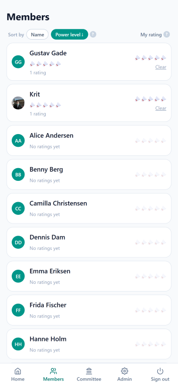

# Social Badminton Club

Badminton club management app with the following features: 
- Members can sign up (Google SSO or username/password) to book sessions and rate the badminton skills of other users. Must be approved by admin to gain access.
- Admins can create and manage sessions, approve new members, and assign user roles
- Built to run entirely inside the **Google Cloud Free Tier**

## Stack

| Piece            | Product                | Free tier covers                          |
| ---------------- | ---------------------- | ----------------------------------------- |
| App + backend    | Cloud Run (1 service)  | 2M requests/month, scales to zero         |
| Database         | Firestore              | 50k reads / 20k writes / 20k deletes a day |
| Auth             | Firebase Auth (Spark)  | 50k monthly active users (Google + email) |
| Photos           | Cloud Storage          | 5 GB, 5k/50k ops                          |
| Build & deploy   | Cloud Build + Artifact Registry | 2,500 min/month, 0.5 GB          |

A small club (dozens of members) uses well under 1% of these limits. This app is NoSQL end-to-end to avoid
Cloud SQL, which has no free tier.

## Pages

- **Home**: public
  landing + CTA when signed out; when signed in: your profile (nickname + photo,
  editable) and the session list (who's signed up, slots left, day/time,
  location).

  
  

- **Members**:
  shows all the club members. You can rate any other player's badminton skill
  level.

  

- **Committee**:
  shows the club committee members.

- **Admin**:
  add/edit/delete sessions, manage participants, approve new sign-ups, assign
  roles, delete users. Visible only to users with the admin role.

  
  

## Sign-up flow & security

1. A visitor signs in with **Google SSO or email/password** (Firebase Auth).
   On first sign-in, a `users/{uid}` doc is created automatically with role
   `member` and `approved: false`.
2. The new account is **pending approval**: they see a "waiting for approval"
   card instead of sessions, can't open the Members page, and can't register,
   join a waitlist, or rate anyone.
3. An admin approves them from the **Admin → Users** tab. The Home page updates
   live the moment it happens (no refresh needed).

The gating is **enforced in `firestore.rules`, not just hidden in the UI**,
no client code can bypass it:

- Only Firebase-authenticated users can read data (`allow read: if signedIn()`).
- Users can only create/update their **own** profile doc, and an update may
  never change `role` or `approved` (`firestore.rules:37-47`). Self-promotion or
  self-approval is rejected by the server, even with a tampered client.
- Only admins (`users/{uid}.role == 'admin'`, verified in the rules) can approve
  users, manage sessions, and delete accounts.
- Registrations, waitlists and ratings additionally require `isApproved()`, so
  a pending user can't write anything.
- The rules also enforce business rules server-side: session capacity, waitlist
  only when full, ratings 1–5 stars.

## Possible features to add later

- Add Sendgrid to inform users about new sessions
- Match planning (with Elo rating based on match results)
- Tournament mode

## Project layout

```
app/
  page.tsx                  Home (public / signed-in)
  login/page.tsx            Google SSO + email/password
  members/page.tsx          Members / ranked leaderboard
  admin/page.tsx            Admin panel
  manifest.ts               PWA manifest
  api/
    bootstrap/              Promote the first admin (server-only)
    admin/users/[uid]/...   Admin REST-ish API (delete a user, future native app seam)
components/
  AuthProvider.tsx          Auth + user profile state
  home/ ...                 Profile card, session list/card
  members/MembersClient.tsx
  admin/AdminUsers|AdminSessions.tsx
lib/
  firebase.ts               Client SDK (lazy init)
  firebase-admin.ts         Server SDK (guarded)
  db.ts                     Firestore/storage helpers + transactions
firestore.rules             Data access rules (roles enforced here)
storage.rules               Profile photo rules
Dockerfile, cloudbuild.yaml, cloudbuild.push.yaml,
deploy.sh, deploy-cloudbuild.sh, deploy-rules.sh, storage-cors.json
```

## Getting started

1. **Create a Firebase project** at <https://console.firebase.google.com>.
   - Enable **Authentication** → sign-in methods → enable **Google** and
     **Email/Password**.
   - Enable **Firestore Database** (production mode) and **Storage**.
   - Add a **Web app** and copy its SDK config.
2. **Configure the app**:

   ```bash
   cp .env.example .env.local   # fill in the NEXT_PUBLIC_FIREBASE_* values
   npm install
   npm run dev                  # http://localhost:3000
   ```

3. **Deploy rules** (one-time, via the Firebase CLI -> `gcloud firestore rules` was
   removed from newer gcloud versions):

   ```bash
   npx --yes firebase-tools login
   ./deploy-rules.sh --project YOUR_PROJECT_ID
   # or manually: npx firebase-tools deploy --only firestore:rules,storage --project YOUR_PROJECT_ID
   ```

   This publishes `firestore.rules` + indexes and `storage.rules` (configured in
   `firebase.json`). Note: Storage rules deploy needs the Storage bucket to exist
   (Blaze plan). To deploy just the Firestore rules first, use
   `--only firestore:rules`.

4. **Create the first admin.** Everyone signs up as `member`, and rules prevent
   self-promotion. After at least one admin email has signed in once, either:
   - call `POST /api/bootstrap` with `ADMIN_EMAILS` set (needs the server SDK
     configured), or
   - edit that user's `role` field in the Firestore console to `admin` once.

## Deploying to Cloud Run (free tier)

Two options:

- **Cloud Build, no Docker needed (recommended here)**:

  ```bash
  gcloud auth login
  gcloud config set project YOUR_PROJECT_ID
  gcloud services enable run.googleapis.com artifactregistry.googleapis.com cloudbuild.googleapis.com
  gcloud artifacts repositories create badminton-club --repository-format=docker --location=us-east1
  ./deploy-cloudbuild.sh      # reads .env.local, builds in Google's cloud, deploys
  ```

- **Local Docker** (uses your own machine, needs Docker installed):

  ```bash
  ./deploy.sh   # requires gcloud auth + docker; reads .env.local
  ```

Keep the service on `min-instances=0` and `max-instances=2` so it costs
nothing when idle and never scales up beyond need.

> **Note:** the `NEXT_PUBLIC_*` Firebase web config is baked into the client at
> build time. Cloud Run only needs `ADMIN_EMAILS` at runtime for the bootstrap
> route; everything else is enforced client-side by Firestore rules.

## Adding new features (e.g. match results)

Firestore is schema-less, so a new feature is a new collection/subcollection,
no migrations. The `matches` subcollection is already permitted in
`firestore.rules` (`/sessions/{sessionId}/matches/{matchId}`). A typical flow:

1. Record a result: write `{ team1: [uid,uid], team2: [uid,uid], score, recordedBy }`.
2. Extend the ranking query to also aggregate wins/losses from `matches`.
3. Add a `components/matches/` folder + `app/matches/` route. No changes to
   existing pages required.

Keep these habits to stay inside the free tier: prefer **subcollections**,
**batch writes** for multi-doc changes, and **aggregation queries**
(`count`/`sum`) instead of pulling whole collections.
